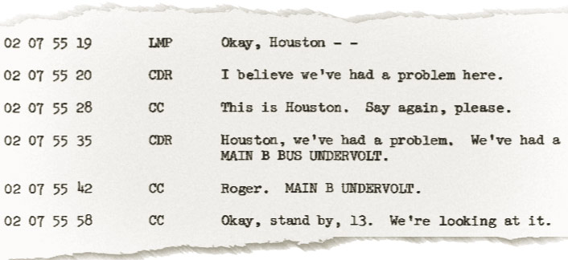
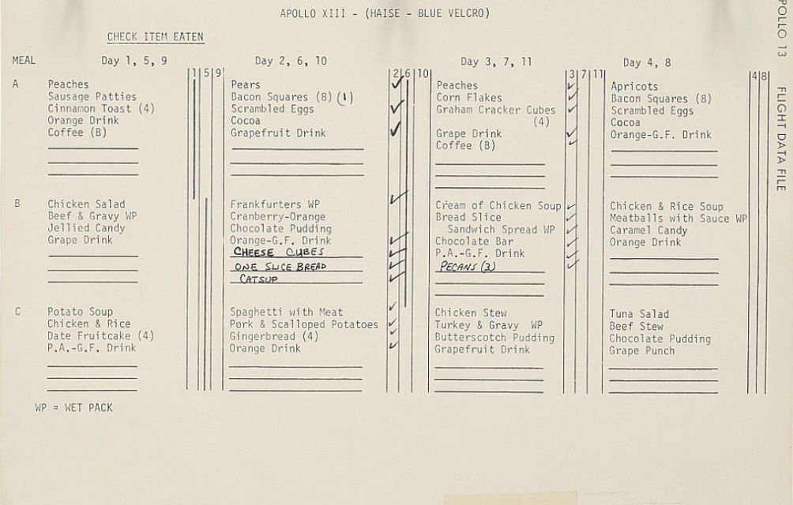
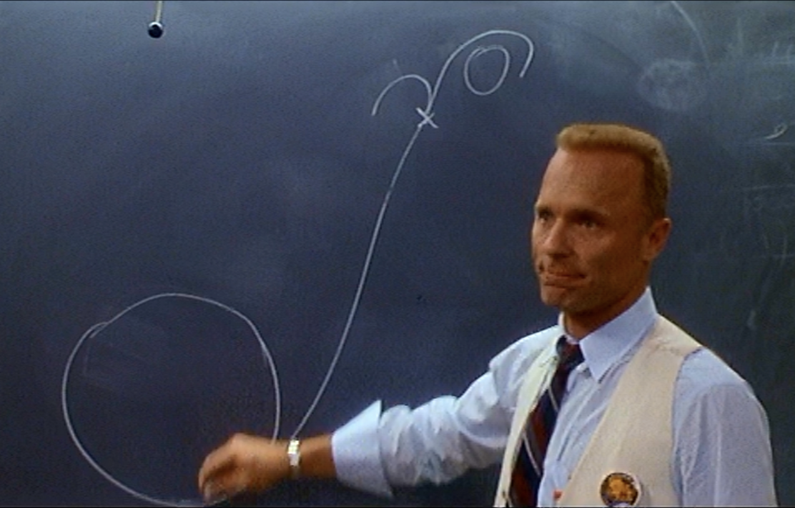
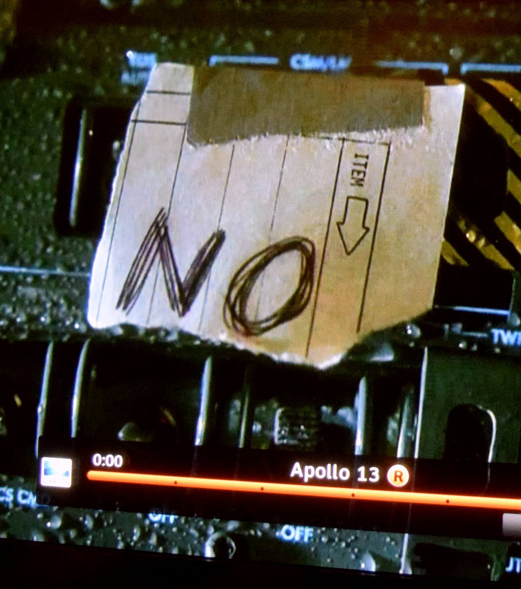
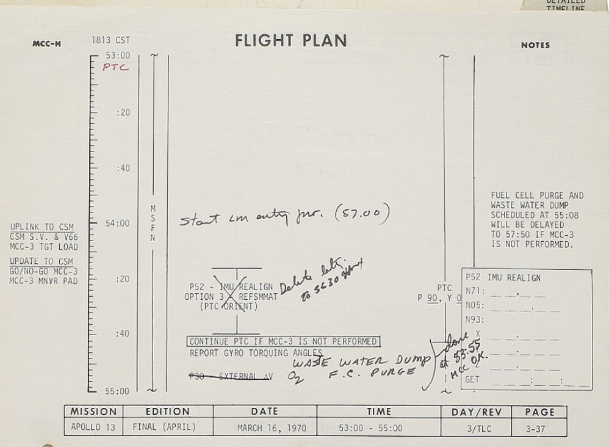

## Is Your IT Training Failing?
We all know that a lot of IT training fails in its objectives, and the problems only increase when we are forced to switch to remote working.
Have you ever considered…
*.	…that training is too often either obvious or irrelevant? When people are working remotely, they can just as easily look things up on YouTube.
*.	…that training is seldom memorable or engaging? Remote learning is all 'on the screen', and there is often very little to capture people’s attention.
*.	…that training usually offers only instruction, with little reasoning behind it? Do this remotely, and there is nothing to stop people getting distracted by other online tasks instead.
Effective remote working is more necessary today than ever before. So let's fix this!

## Adoption, not Training
We provide an immersive adoption experience; where groups of people experience a dramatic scenario and acquire new ways of working as part of a gripping narrative.

##How do we adopt Microsoft Teams?
We use the well-known story of the Apollo 13 mission (the one where the astronaut says "Houston, we have a problem!") This allows us to focus on helping users with the things they find most challenging, as we weave the learning goals into a memorable and engaging real-time situations.

Using the mission as a background scenario, users get to learn the fundamentals of Microsoft Teams, Microsoft Planner and Document Sharing in an active and collaborative way. 

We use the story of the Apollo 13 mission, its the one where the astronaut says "Houston we have a problem."

With the Apollo 13 mission as a backdrop, users live and learn the fundamentals of Microsoft Teams, Planner and Document Collaboration. We selected content that focuses on helping users with the things they find most challenging. 

Here is a list of course content - to show you how we weave together the learning goals with a memorable story:

* Channels to manage the different concurrent collaboration activities - Houston and the Astronauts have a channel, and there will need to be another one so that the engineers can work collaboratively

* Chat - how else to communicate with the astronauts in real-time.

* Document sharing - it's going to be vital to share documents, specifications, and collaborate upon them in real-time. 
* Planner  - Task management is going to be crucial; users will get a chance to try out which work best. 

* Whiteboard - obviously

* Forms something like this?

* Wiki or OneNote-  What better methods could there be for collaboratively capturing lessons learned as you have them.  This is how they did back then:

* We will also make use of Microsoft streams to host clips of the film to set the scene 
* Guest access so that manufacturers and journalists can communicate.

