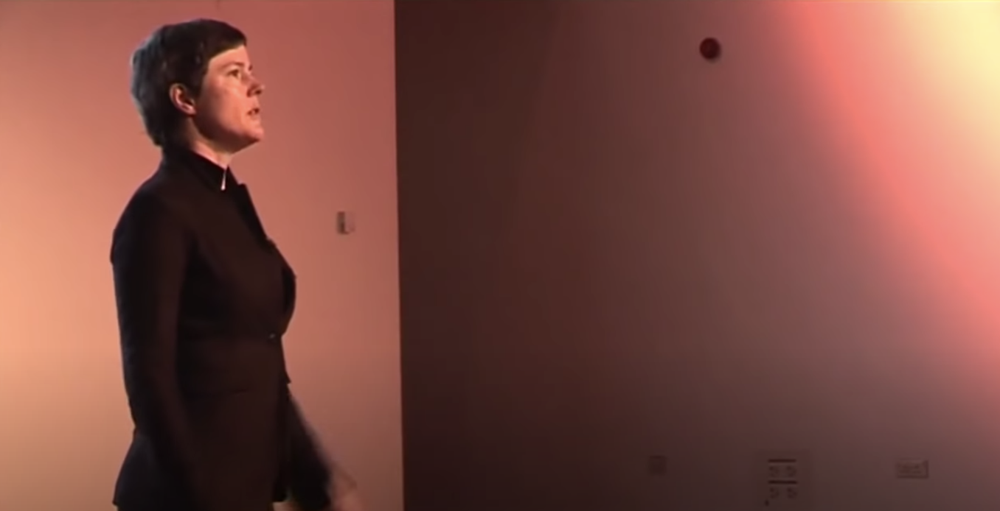
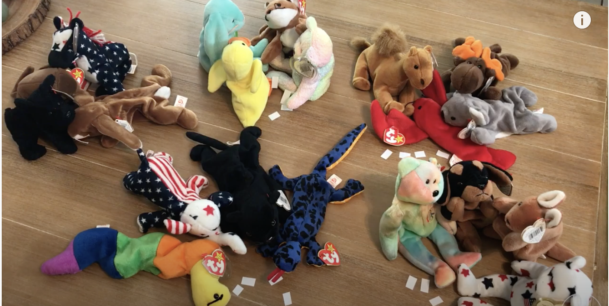

There is lots to say about all these things - but here is a taster of some of the ways that we do things differently.

### Clean language 
It's a truism that listening is the most valuable and least valued skill that a person or an organization can have, clean language is listening turned up to 11 !. Its a series of seeming simple questions that when used with curiosity help show up a person, a group of people or an organizations way of thinking. 

Here's a video to introduce you to Clean Language

### Liberating structures 
Gives you an evolving suite of tools, that are more like games, that enable parallel creativity, it's these that make possible productive bumping into, brain-storming and a host of other mind-expanding ways of working.

Here's a video showing you everyone's favourite liberating structure. 1-2-4-all.

### Stoicism
We take from a noble history, a simple lesson which is that before you react in either in anger or sorrow take a beat and consider is this your anger or sorrow. 

### Hedonic Sustainability 
Stoicism teaches that if we can step out of a negative feeling for even a moment we can gain insight. Modern psychology teaches that well-being comes from stepping into positive emotions and experiences, celebration, gratitude and 'counting one's blessings' could be the most important things we can do for ourselves and those around us.

### Agile project management 
Enables a group of people or team to work on a set of tasks that amount to a meaningful deliverable thing, such that each person has sufficient freedom to engage their particular skills without getting under each other's feet and without the need of overseeer.

